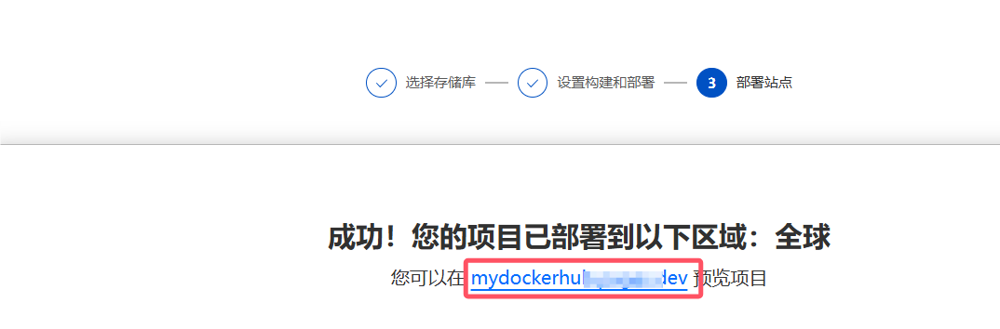

# Ubuntu本地安装Docker

[toc]

> 官方文档：[Install Docker Engine on Ubuntu | Docker Docs](https://docs.docker.com/engine/install/ubuntu/#install-from-a-package)

- [Ubuntu18.04 Docker安装包](https://github.com/gy8801/DockerPackage---1804)
- [Ubuntu20.04 Docker安装包](https://github.com/gy8801/DockerPackage---2004)
- [Ubuntu22.04 Docker安装包](https://github.com/gy8801/DockerPackage---2204)
- [Ubuntu24.04 Docker安装包 ](https://github.com/gy8801/DockerPackage---2404)


## 查看Ubuntu系统版本代号

**常见版本代号**

| 版本  | 代号 Codename |
| ----- | ------------- |
| 18.04 | bionic        |
| 20.04 | focal         |
| 22.04 | jammy         |
| 24.04 | noble         |

**手动查看**

```sh
lsb_release -a
# 或
lsb_release -c
```

`Codename`为版本代号，24.04此处为`noble`


## 安装

1. **将对应版本代号下的包上传至服务器的某个文件夹**


2. **服务器进入该文件夹执行命令**

   安装顺序可以为：containerd、docker-ce-cli、docker-buildx-plugin、docker-ce、docker-compose-plugin，遇到安装失败的情况可以改变下安装顺序

   ```bash
   # 注意：xxx.deb指的是包文件，请自行指定本地包文件名，逐个进行安装
   sudo dpkg -i xxx.deb
   ```

3. **启动**

   ```bash
   sudo service docker start
   # 设置自启动
   sudo systemctl enable docker
   ```

   

## 修改镜像源

Docker镜像源配置文件在`/etc/docker/daemon.json`

```bash
sudo vim  /etc/docker/daemon.json
```

编辑json文件，将镜像源地址写进json数组中，请将`https://yourhub.com`替换为真实的镜像源地址

```json
{
    "registry-mirrors": [
        "https://yourhub.com"
    ]
}
```

重启生效

```bash
#重启daemon进程
sudo systemctl daemon-reload
#重启docker
sudo systemctl restart docker
```


## 自建镜像源

1. 前往GitHub Fork该仓库

   https://github.com/cmliu/CF-Workers-docker.io

   

   Fork之后会在自己的仓库中

   

   

2. 打开Cloudflare界面，登录后，进入`Workers 和 Pages`界面，创建应用程序，选择Pages、连接到GIt，之后关联Git账号

   https://www.cloudflare.com/zh-cn/

   

3. 登录Git账号后，选择刚才GitHub上fork的项目，可以修改项目名称方便记忆

   

4. 点击`保存并部署`后，等待出现这个界面表示部署完成，红框内就是你的镜像源地址，如果你有域名，可以在`自定义域`中设置，此处不做赘述

   

5. 此时便可以将Docker镜像源地址设置为你的镜像源地址。*将`https://xxx.dev`替换为你的镜像源地址*

   ```json
   {
       "registry-mirrors": [
           "https://xxx.dev"
       ]
   }
   ```

   
